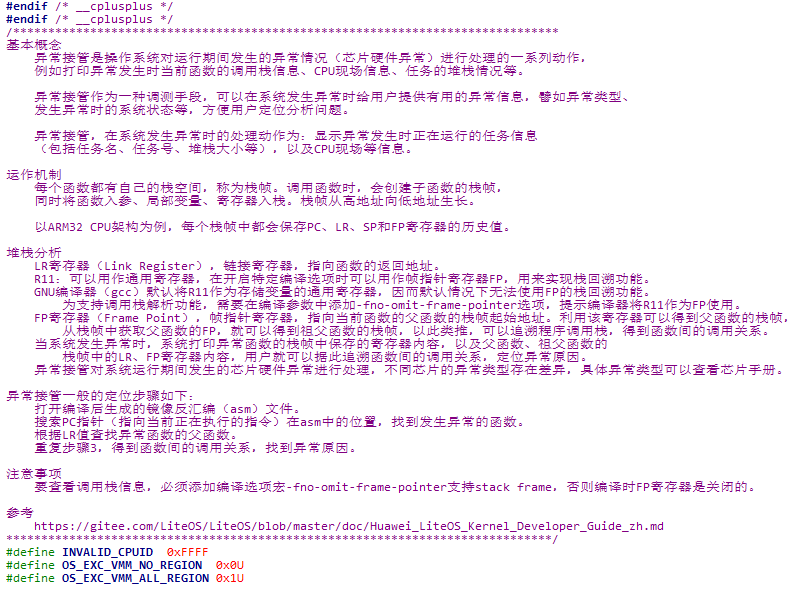
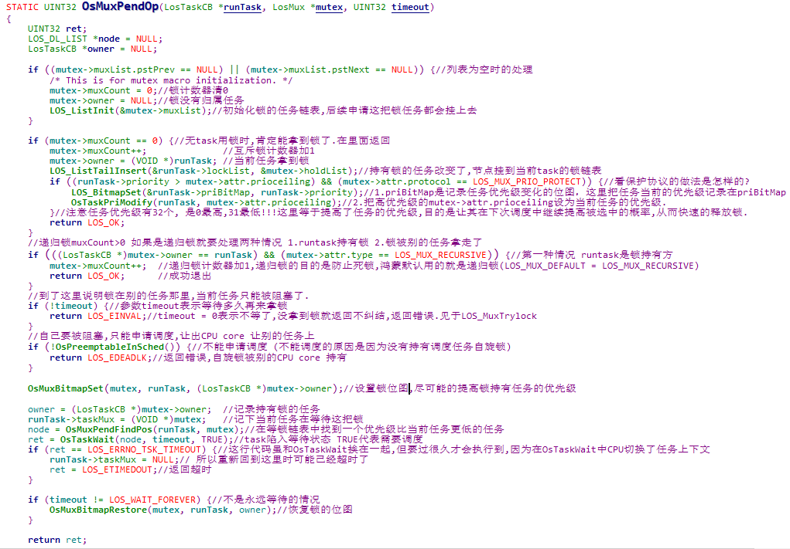
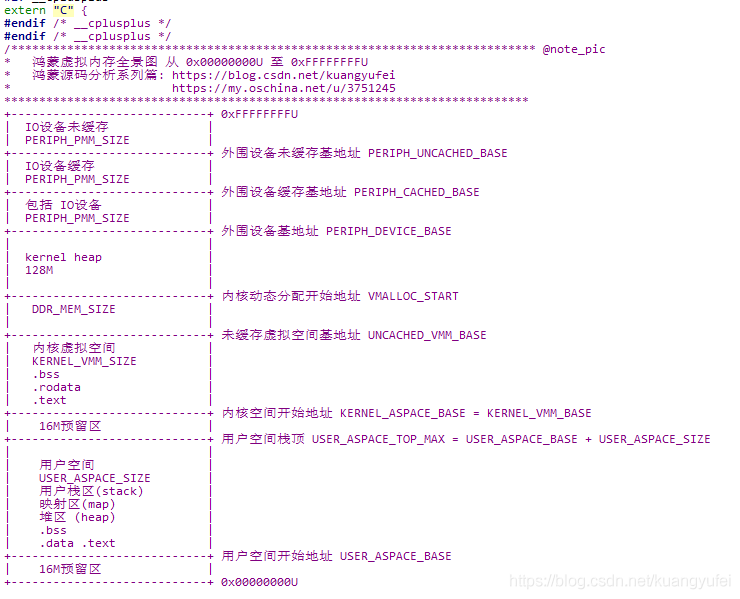

[鸿蒙内核源码注释中文版 【 Gitee仓 ](https://gitee.com/weharmony/kernel_liteos_a_note) | [ CSDN仓 ](https://codechina.csdn.net/kuangyufei/kernel_liteos_a_note) | [ Github仓 ](https://github.com/kuangyufei/kernel_liteos_a_note) | [ Coding仓 】](https://weharmony.coding.net/public/harmony/kernel_liteos_a_note/git/files) 精读内核源码,中文详细注解.深挖地基工程,构建底层网图.

[鸿蒙源码分析系列篇 【 CSDN ](https://blog.csdn.net/kuangyufei/article/details/108727970) [| OSCHINA ](https://my.oschina.net/u/3751245/blog/4626852) [| WIKI 】](https://gitee.com/weharmony/kernel_liteos_a_note/wikis/pages) 问答式导读, 生活式比喻, 图形化展示, 层层剥开内核神秘外衣.

---

# **鸿蒙内核源码注释中文版 | 深挖内核地基工程**

每个码农,学职生涯,都应精读一遍内核源码.精读内核源码最大的好处是:将孤立知识点织成一张高浓度,高密度底层网,是对计算机底层体系化理解形成永久记忆

## **做了些什么呢？**

**[WeHarmony/kernel\_liteos\_a_note](https://gitee.com/weharmony/kernel_liteos_a_note)** 是在鸿蒙官方开源项目 **[OpenHarmony/kernel\_liteos\_a](https://gitee.com/openharmony/kernel_liteos_a)** 基础上给源码加上中文注解的版本,目前几大核心模块加注已基本完成, **整体加注完成70%**, 正持续加注完善中 ...

-   ### **为何想给鸿蒙内核源码加上中文注释**
    
    源于大学时阅读linux 2.6 内核痛苦经历,一直有个心愿,如何让更多对内核感兴趣的同学减少阅读时间,加速对计算机系统级的理解,而不至于过早的放弃.但因过程种种,多年一直没有行动,基本要放弃这件事了. 恰逢 2020/9/10 鸿蒙正式开源,重新激活了多年的心愿,就有那么点一发不可收拾了. :|P
    
-   ### **致敬鸿蒙内核开发者**
    
    感谢开放原子开源基金会,鸿蒙内核开发者提供了如此优秀的源码,一了多年的夙愿,津津乐道于此.精读内核源码当然是件很困难的事,时间上要以月甚至年为单位,但正因为很难才值得去做! 干困难事,必有所得. 专注聚焦,必有所获. 致敬内核开发者,从内核一行行的代码中能深深体会到开发者各中艰辛与坚持,及鸿蒙生态对未来的价值,可以毫不夸张的说鸿蒙内核源码可作为大学C语言,数据结构,操作系统,汇编语言 四门课程的教学项目.如此宝库,不深入研究实在是暴殄天物,于心不忍,注者坚信鸿蒙大势所趋,未来可期,是其坚定的追随者和传播者.

-   ### **加注方式是怎样的？**
    
    因鸿蒙内核6W+代码量,本身只有较少的注释, 中文注解以不对原有代码侵入为前提,源码中所有英文部分都是原有注释,所有中文部分都是中文版的注释,尽量不去增加代码的行数,不破坏文件的结构,试图把知识讲透彻,注释多类似以下的方式:

    在每个模块的.c文件开始位置先对模块功能做整体的介绍,例如异常接管模块注解如图所示:

    

    注解过程中查阅了很多的资料和书籍,在具体代码处都附上了参考链接.

    而函数级注解会详细到重点行,甚至每一行, 例如申请互斥锁的主体函数,不可谓不重要,而官方注释仅有一行,如图所示
    
    
    
    另外画了一些字符图方便理解,直接嵌入到头文件中,比如虚拟内存的全景图,因没有这些图是很难理解虚拟内存是如何管理的.
    
    

-   ### **有哪些特殊的记号**

    搜索 **[@note_pic]()** 可查看绘制的全部字符图

    搜索 **[@note_why]()** 是尚未看明白的地方，有看明白的，请Pull Request完善

    搜索 **[@note_thinking]()** 是一些的思考和建议

    搜索 **[@note_#if0]()** 是由第三方项目提供不在内核源码中定义的极为重要结构体，为方便理解而添加的。

    搜索 **[@note_good]()** 是给源码点赞的地方

-   ### **理解内核的三个层级**
    
    注者认为理解内核可分三个层级:
    
    第一: **普通概念映射级** 这一级不涉及专业知识,用大众所熟知的公共认知就能听明白是个什么概念,也就是说用一个普通人都懂的概念去诠释或者映射一个他们从没听过的概念.说别人能听得懂的话这很重要!!! 一个没学过计算机知识的卖菜大妈就不可能知道内核的基本运作了吗? 不一定!,在系列篇中试图用 **[鸿蒙源码分析系列篇|张大爷系列故事【 CSDN](https://blog.csdn.net/kuangyufei/article/details/108727970) [| OSCHINA](https://my.oschina.net/u/3751245/blog/4626852) [| WIKI 】](https://gitee.com/weharmony/kernel_liteos_a_note/wikis/pages)** 去引导这一层级的认知,希望能卷入更多的人来关注基础软件,尤其是那些资本大鳄,加大对基础软件的投入.
    
    第二: **专业概念抽象级** 对抽象的专业逻辑概念具体化认知, 比如虚拟内存,老百姓是听不懂的,学过计算机的人都懂,具体怎么实现的很多人又都不懂了,但这并不妨碍成为一个优秀的上层应用程序员,因为虚拟内存已经被抽象出来,目的是要屏蔽上层对它的现实认知.试图用 **[鸿蒙源码分析系列篇 【 CSDN](https://blog.csdn.net/kuangyufei/article/details/108727970) [| OSCHINA](https://my.oschina.net/u/3751245/blog/4626852) [| WIKI 】](https://gitee.com/weharmony/kernel_liteos_a_note/wikis/pages)** 去拆解那些已经被抽象出来的专业概念, 希望能卷入更多对内核感兴趣的应用软件人才流入基础软件生态, 应用软件咱们是无敌宇宙,但基础软件却很薄弱.
    
    第三: **具体微观代码级** 这一级是具体到每一行代码的实现,到了用代码指令级的地步,这段代码是什么意思?为什么要这么设计? **[kernel\_liteos\_a_note:鸿蒙内核源码注释中文版](https://gitee.com/weharmony/kernel_liteos_a_note)** 试图从细微处去解释代码实现层,英文真的是天生适合设计成编程语言的人类语言,计算机的01码映射到人类世界的26个字母,诞生了太多的伟大奇迹.但我们的母语注定了很大部分人存在着自然语言层级的理解映射,希望注释中文版能让更多爱好者快速的理解内核,共同进步.

-   ### **鸿蒙内核500问，你知道多少？**

    抛出的500个内核知识问题,可前往 **[鸿蒙内核源码分析(源码结构篇) | 内核500问 【 CSDN ](https://blog.csdn.net/kuangyufei/article/details/111938348) [| OSCHINA 】](https://my.oschina.net/u/3751245/blog/4869137)** 查看.   
    
-   ### **系列博客更新到哪里了？**

    把研究过程心得写成鸿蒙源码分析系列篇,如此源码中文注释+系列篇文章,将加速理解鸿蒙内核实现过程,因时间有限,博文更新较慢,会反复修正.

    - **[鸿蒙源码分析系列(总目录) | 持续更新中... 【 CSDN ](https://blog.csdn.net/kuangyufei/article/details/108727970) [| OSCHINA 】](https://my.oschina.net/u/3751245/blog/4626852)**

        * **[|-  鸿蒙内核源码分析(源码结构篇) | 内核500问你能答对多少？ 【 CSDN ](https://blog.csdn.net/kuangyufei/article/details/111938348) [| OSCHINA 】](https://my.oschina.net/u/3751245/blog/4869137)**

        * **[|-  鸿蒙内核源码分析(物理内存篇) | 伙伴算法是在卖标准猪肉块吗？【 CSDN ](https://blog.csdn.net/kuangyufei/article/details/111765600) [| OSCHINA 】](https://my.oschina.net/u/3751245/blog/4842408)**

        * **[|-  鸿蒙内核源码分析(内存规则篇) | 内存管理到底在管什么？【 CSDN ](https://blog.csdn.net/kuangyufei/article/details/109437223) [| OSCHINA 】](https://my.oschina.net/u/3751245/blog/4698384)**

        * **[|-  鸿蒙内核源码分析(源码注释篇) | 精读内核源码有哪些好处？【 CSDN ](https://blog.csdn.net/kuangyufei/article/details/109251754) [| OSCHINA 】](https://my.oschina.net/u/3751245/blog/4686747)**

        * **[|-  鸿蒙内核源码分析(内存映射篇) | 虚拟内存-物理内存是如何映射的？【 CSDN ](https://blog.csdn.net/kuangyufei/article/details/109032636) [| OSCHINA 】](https://my.oschina.net/u/3751245/blog/4694841)**

        * **[|-  鸿蒙内核源码分析(内存汇编篇) | 什么是虚拟内存的实现基础？【 CSDN ](https://blog.csdn.net/kuangyufei/article/details/108994081) [| OSCHINA 】](https://my.oschina.net/u/3751245/blog/4692156)**

        * **[|-  鸿蒙内核源码分析(内存分配篇) | 内存有哪些分配方式？【 CSDN ](https://blog.csdn.net/kuangyufei/article/details/108989906) [| OSCHINA 】](https://my.oschina.net/u/3751245/blog/4646802)**

        * **[|-  鸿蒙内核源码分析(内存管理篇) | 鸿蒙虚拟内存全景图是怎样的？【 CSDN ](https://blog.csdn.net/kuangyufei/article/details/108821442) [| OSCHINA 】](https://my.oschina.net/u/3751245/blog/4652284)**

        * **[|-  鸿蒙内核源码分析(内存概念篇) | 虚拟内存虚在哪里？【 CSDN ](https://blog.csdn.net/kuangyufei/article/details/108723672) [| OSCHINA 】](https://my.oschina.net/u/3751245/blog/4646802)**

        * **[|-  鸿蒙内核源码分析(必读故事篇) | 张大爷的故事 | 用故事说内核持续更新中...【 CSDN ](https://blog.csdn.net/kuangyufei/article/details/108745174) [| OSCHINA 】](https://my.oschina.net/u/3751245/blog/4634668)**

        * **[|-  鸿蒙内核源码分析(调度机制篇) | 任务是如何被调度执行的？【 CSDN ](https://blog.csdn.net/kuangyufei/article/details/108705968) [| OSCHINA 】](https://my.oschina.net/u/3751245/blog/4623040)**

        * **[|-  鸿蒙内核源码分析(调度队列篇) | 就绪队列对调度的作用【 CSDN ](https://blog.csdn.net/kuangyufei/article/details/108626671) [| OSCHINA 】](https://my.oschina.net/u/3751245/blog/4606916)**

        * **[|-  鸿蒙内核源码分析(任务管理篇) | 任务是内核调度的单元【 CSDN ](https://blog.csdn.net/kuangyufei/article/details/108621428) [| OSCHINA 】](https://my.oschina.net/u/3751245/blog/4603919)**

        * **[|-  鸿蒙内核源码分析(时钟管理篇) | 触发调度最大的动力来自哪里？【 CSDN ](https://blog.csdn.net/kuangyufei/article/details/108603468) [| OSCHINA 】](https://my.oschina.net/u/3751245/blog/4574493)**

        * **[|-  鸿蒙内核源码分析(进程管理篇) | 进程是内核资源管理单元【 CSDN ](https://blog.csdn.net/kuangyufei/article/details/108595941) [| OSCHINA 】](https://my.oschina.net/u/3751245/blog/4574429)**

        * **[|-  鸿蒙内核源码分析(双向链表篇) | 谁是内核最重要结构体？【 CSDN ](https://blog.csdn.net/kuangyufei/article/details/108585659) [| OSCHINA 】](https://my.oschina.net/u/3751245/blog/4572304)**
    
-   ### **通过fork及时同步最新注解内容**

    注解几乎占用了所有的空闲时间,每天都会更新,每天都有新感悟,一行行源码在不断的刷新和拓展对内核知识的认知边界. 对已经关注和fork的同学请及时同步最新的注解内容. 内核知识点体量实在太过巨大,过程会反复修正完善,力求言简意赅,词达本意.肯定会有诸多错漏之处,请多包涵. :)  

-   ### **新增的zzz目录是干什么的?**
    
    中文加注版比官方版无新增文件,只多了一个zzz的目录,里面放了一些文件,它与内核代码无关,大家可以忽略它,取名zzz是为了排在最后,减少对原有代码目录级的侵入,zzz的想法源于微信中名称为AAA的那帮朋友,你的微信里应该也有他们熟悉的身影吧 :|P  

-   ### **参与贡献**
    1. Fork 本仓库 >> 新建 Feat_xxx 分支 >> 提交代码注解 >> [新建 Pull Request](https://gitee.com/weharmony/kernel_liteos_a_note/pull/new/weharmony:master...weharmony:master)

    2. [新建 Issue](https://gitee.com/weharmony/kernel_liteos_a_note/issues)

-   ### **鸿蒙内核源码分析 官方公众号**

    

    感谢关注,您的支持是注者最大的动力. 

    作者邮箱:weharmony@126.com

    ---

    系列篇文章 进入 >\> [鸿蒙系统源码分析(总目录) 【 CSDN](https://blog.csdn.net/kuangyufei/article/details/108727970) | [OSCHINA](https://my.oschina.net/u/3751245/blog/4626852) [| WIKI 】](https://gitee.com/weharmony/kernel_liteos_a_note/wikis/pages)查看
    
    注释中文版 进入 >\> [鸿蒙内核源码注释中文版 【 Gitee仓](https://gitee.com/weharmony/kernel_liteos_a_note) | [CSDN仓](https://codechina.csdn.net/kuangyufei/kernel_liteos_a_note) | [Github仓](https://github.com/kuangyufei/kernel_liteos_a_note) | [Coding仓 】](https://weharmony.coding.net/public/harmony/kernel_liteos_a_note/git/files)阅读
    