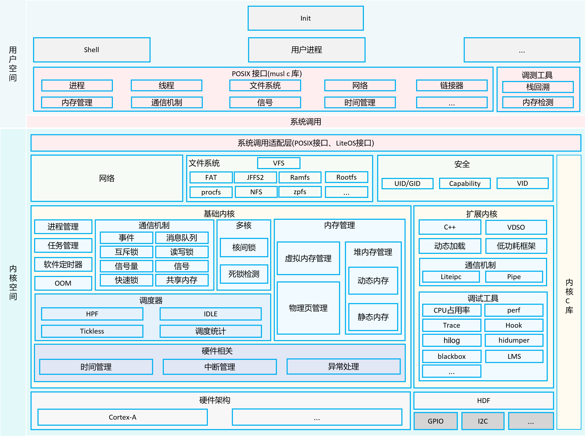

访问 >> [ 国内  ](http://weharmonyos.com)  |  [国外 ](https://weharmony.github.io)

**中文注解鸿蒙轻内核 | [kernel_liteos_a_note](https://gitee.com/weharmony/kernel_liteos_a_note)** 是在 `OpenHarmony` 的 [kernel_liteos_a](https://gitee.com/openharmony/kernel_liteos_a) 基础上给内核源码加上中文注解的版本，同步官方代码迭代推进。

## 为何要精读内核源码？
* 码农的学职生涯，都应精读一遍内核源码。以浇筑好计算机知识大厦的地基，地基纵深的坚固程度，很大程度能决定未来大厦能盖多高。那为何一定要精读细品呢？
* 因为内核代码本身并不太多，都是浓缩的精华，精读是让各个知识点高频出现，不孤立成点状记忆，没有足够连接点的知识点是很容易忘的，点点成线，线面成体，连接越多，记得越牢，如此短时间内容易结成一张高浓度，高密度的系统化知识网，训练大脑肌肉记忆，驻入大脑直觉区，想抹都抹不掉，终生携带，随时调取。跟骑单车一样，一旦学会，即便多年不骑，照样跨上就走，游刃有余。
## 热爱是所有的理由和答案
* 因大学时阅读 linux 2.6 内核痛并快乐的经历，一直有个心愿，对底层基础技术进行一次系统性的整理，方便自己随时翻看，同时让更多对底层感兴趣的小伙伴减少时间，加速对计算机系统级的理解，而不至于过早的放弃。但因过程种种，多年一直没有行动，基本要放弃这件事了。恰逢 2020/9/10 鸿蒙正式开源，重新激活了多年的心愿，就有那么点如黄河之水一发不可收拾了。

* 包含三部分内容：**注源**，**写博** ，**画图**， 目前对内核源码的注解完成 80% ，博客分析完成80+篇，百图画鸿蒙完成20张，空闲时间几乎被占用，时间不够用，但每天都很充实，连做梦鸿蒙系统都在鱼贯而入。是件很有挑战的事，时间单位以年计，已持续一年半，期间得到众多小伙伴的支持与纠错，在此谢过 ! :P
## (〃･ิ‿･ิ)ゞ鸿蒙轻内核开发者
* 感谢开放原子开源基金会，致敬鸿蒙轻内核开发者提供了如此优秀的源码，一了多年的夙愿，津津乐道于此。从内核一行行的代码中能深深感受到开发者各中艰辛与坚持，及鸿蒙生态对未来的价值，这些是张嘴就来的网络喷子们永远不能体会到的。可以毫不夸张的说鸿蒙轻内核源码可作为大学：C语言，数据结构，操作系统，汇编语言，计算机系统结构，计算机组成原理，微机接口 七门课程的教学项目。如此宝库，不深入研究实在是暴殄天物，于心不忍，坚信鸿蒙大势所趋，未来可期，其必定成功，也必然成功，誓做其坚定的追随者和传播者。
  
## 理解内核的三个层级

* 普通概念映射级：这一级不涉及专业知识，用大众所熟知的公共认知就能听明白是个什么概念，也就是说用一个普通人都懂的概念去诠释或者映射一个他们从没听过的概念。让陌生的知识点与大脑中烂熟于心的知识点建立多重链接，加深记忆。说别人能听得懂的话这很重要。一个没学过计算机知识的卖菜大妈就不可能知道内核的基本运作了吗？不一定。在系列篇中试图用故事，打比方，去引导这一层级的认知，希望能卷入更多的人来关注基础软件，人多了场子热起来了创新就来了。
* 专业概念抽象级：对抽象的专业逻辑概念具体化认知， 比如虚拟内存，老百姓是听不懂的，学过计算机的人都懂，具体怎么实现的很多人又都不懂了，但这并不妨碍成为一个优秀的上层应用开发者，因为虚拟内存已经被抽象出来，目的是要屏蔽上层对它具体实现的认知。试图用百篇博客系列篇去拆解那些已经被抽象出来的专业概念， 希望能卷入更多对内核感兴趣的应用软件人才流入基础软硬件生态， 应用软件咱们是无敌宇宙，但基础软件却很薄弱。
* 具体微观代码级：这一级是具体到每一行代码的实现，到了用代码指令级的地步，这段代码是什么意思？为什么要这么设计？有没有更好的方案？[鸿蒙轻内核源码注解分析](https://gitee.com/weharmony/kernel_liteos_a_note) 试图从细微处去解释代码实现层，英文真的是天生适合设计成编程语言的人类语言，计算机的01码映射到人类世界的26个字母，诞生了太多的伟大奇迹。但我们的母语注定了很大部分人存在着自然语言层级的理解映射，希望内核注解分析能让更多爱好者节约时间成本，哪怕节约一分钟也是这件事莫大的意义。

## 四个维度解剖内核
为了全方位剖析内核，在 **画图**，**写文**，**注源**，**成册** 四个方向做了努力，试图以**讲故事**，**画图表**，**写文档**，**拆源码** 立体的方式表述内核。很喜欢易中天老师的一句话:研究方式不等于表述方式。底层技术并不枯燥，它可以很有意思，它可以是我们生活中的场景。

### 一： 百图画鸿蒙 | 一图一主干 | 骨骼系统
* 如果把鸿蒙比作人，百图目的是要画出其骨骼系统。
* 百图系列每张图都是心血之作，耗时甚大，能用一张就绝不用两张，所以会画的比较复杂，高清图会很大，可在公众号中回复 **百图** 获取`3`倍超高清最新图。`v**.xx`代表图的版本，请留意图的更新。
* 例如： **双向链表** 是内核最重要的结构体，站长更愿意将它比喻成人的左右手，其意义是通过寄生在宿主结构体上来体现，可想象成在宿主结构体装上一对对勤劳的双手，它真的很会来事，超级活跃分子，为宿主到处拉朋友，建圈子。其插入 | 删除 | 遍历操作是它最常用的社交三大件，若不理解透彻在分析源码过程中很容易卡壳。虽在网上能找到很多它的图,但怎么看都不是自己想要的，干脆重画了它的主要操作。
*  

### 二： 百文说内核 | 抓住主脉络 | 肌肉器官

* 百文相当于摸出内核的肌肉和器官系统，让人开始丰满有立体感，因是直接从注释源码起步，在加注释过程中，每每有心得处就整理,慢慢形成了以下文章。内容立足源码，常以生活场景打比方尽可能多的将内核知识点置入某种场景，具有画面感，容易理解记忆。说别人能听得懂的话很重要! 百篇博客绝不是百度教条式的在说一堆诘屈聱牙的概念，那没什么意思。更希望让内核变得栩栩如生，倍感亲切。
* 与代码需不断`debug`一样，文章内容会存在不少错漏之处，请多包涵，但会反复修正，持续更新，`v**.xx` 代表文章序号和修改的次数，精雕细琢，言简意赅，力求打造精品内容。
* 百文在 < weharmony.github.io | 开源中国 | 博客园 | 51cto | csdn | 知乎 | 掘金 > 站点发布。
  
  

  [>> 进入详细了解](./zzz/blog.md)


### 三： 百万注内核 | 处处扣细节 | 细胞血管
* 百万汉字注解内核目的是要看清楚其毛细血管，细胞结构，等于在拿放大镜看内核。内核并不神秘，带着问题去源码中找答案是很容易上瘾的，你会发现很多文章对一些问题的解读是错误的，或者说不深刻难以自圆其说，你会慢慢形成自己新的解读，而新的解读又会碰到新的问题，如此层层递进，滚滚向前，拿着放大镜根本不愿意放手。
* 因鸿蒙轻内核6W+代码量，本身只有较少的注释， 中文注解以不对原有代码侵入为前提，源码中所有英文部分都是原有注释，所有中文部分都是中文版的注释，同时为方便同步官方版本的更新，尽量不去增加代码的行数，不破坏文件的结构，注释多类似以下的方式:

  * 在重要模块的`.c/.h`文件开始位置先对模块功能做整体的介绍，例如异常接管模块注解如图所示:
  
    
    注解过程中查阅了很多的资料和书籍，在具体代码处都附上了参考链接。
  * 绘制字符图帮助理解模块 ，例如 虚拟内存区域分布没有图很难理解。
    
  * 而函数级注解会详细到重点行，甚至每一行， 例如申请互斥锁的主体函数，不可谓不重要，而官方注释仅有一行，如图所示
    
    

* 注解创建了一些特殊记号，可直接搜索查看
  - [x] 搜索 `@note_pic` 可查看绘制的全部字符图
  - [x] 搜索 `@note_why` 是尚未看明白的地方，有看明白的，请[新建 Pull Request](https://gitee.com/weharmony/kernel_liteos_a_note/pull/new/weharmony:master...weharmony:master)完善
  - [x] 搜索 `@note_thinking` 是一些的思考和建议
  - [x] 搜索 `@note_#if0` 是由第三方项目提供不在内核源码中定义的极为重要结构体，为方便理解而添加的。
  - [x] 搜索 `@note_link` 是网址链接，方便理解模块信息，来源于官方文档，百篇博客，外部链接
  - [x] 搜索 `@note_good` 是给源码点赞的地方

### 四： 参考手册 | Doxygen呈现 | 诊断

在中文加注版基础上构建了参考手册，如此可以看到毛细血管级的网络图，注解支持 [doxygen](https://www.doxygen.nl) 格式标准。
* 图为内核`main`的调用关系直观展现，如果没有这张图，光`main`一个函数就够喝一壶。 `main`本身是由汇编指令 `bl main`调用
  
  可前往 >> [doxygen.weharmonyos.com | 参考手册 ](http://doxygen.weharmonyos.com/index.md) 体验

* 图为内核所有结构体索引，点击可查看每个结构变量细节
  
  可前往 >> [doxygen.weharmonyos.com | 结构体索引 ](http://doxygen.weharmonyos.com/classes.md) 体验


  
## 四大码仓发布 | 源码同步官方
内核注解同时在 [gitee](https://gitee.com/weharmony/kernel_liteos_a_note) | [github](https://github.com/kuangyufei/kernel_liteos_a_note) | [coding](https://weharmony.coding.net/public/harmony/kernel_liteos_a_note/git/files) | [gitcode](https://gitcode.net/kuangyufei/kernel_liteos_a_note) 发布，并与官方源码按月保持同步，同步历史如下:
* `2025/07/02` -- 同步最新代码,对 epoll，process,mem 模块有少量修改
* `2025/02/22` -- 同步官方几处小改，同时后续将会参考deepseek注解做精做强
* `2024/04/13` -- 官方几处小修正
* `2024/03/04` -- 官方修改很小
* `2023/11/24` -- 几处小的修改
* `2023/10/11` -- 近五个月官方很少更新
* `2023/05/26` -- BUILD.gn 相关
* `2023/04/10` -- 调度算法优化，加入deadline
* `2023/03/01` -- 增加网络容器和容器限额功能
* `2023/02/13` -- 支持proc/self目录
* `2023/01/14` -- 同步官方代码，支持PID容器
* `2022/11/01` -- 删除 PLATFORM_QEMU_ARM_VIRT_CA7 侵入内核的所有代码
* `2022/09/21` -- 主线代码没有变化,只完善了测试用例
* `2022/07/18` -- 开机代码微调
* `2022/06/03` -- 增加 jffs2 编译选项
* `2022/05/09` -- 标准库(musl , newlib) 目录调整
* `2022/04/16` -- 任务调度模块有很大更新
* `2022/03/23` -- 新增各CPU核自主管理中断, 定时器模块较大调整
* `2022/02/18` -- 官方无代码更新, 只有测试用例的完善
* `2022/01/20` -- 同步官方代码,本次官方对测试用例和MMU做了较大调整
* `2021/12/20` -- 增加`LMS`模块，完善`PM，Fat Cache`
* `2021/11/12` -- 加入`epoll`支持，对`shell`模块有较大调整，微调`process`，`task`，更正单词拼写错误
* `2021/10/21` -- 增加性能优化模块`perf`，优化了文件映射模块
* `2021/09/14` -- `common`，`extended`等几个目录结构和Makefile调整
* `2021/08/19` -- 各目录增加了`BUILD。gn`文件，文件系统部分文件调整 
* `2021/07/15` -- 改动不大，新增`blackbox`，`hidumper`，对一些宏规范化使用 
* `2021/06/27` -- 对文件系统/设备驱动改动较大，目录结构进行了重新整理
* `2021/06/08` -- 对编译构建，任务，信号模块有较大的改动
* `2021/05/28` -- 改动不大，主要针对一些错误单词拼写纠正
* `2021/05/13` -- 对系统调用，任务切换，信号处理，异常接管，文件管理，`shell`做了较大更新，代码结构更清晰
* `2021/04/21` -- 官方优化了很多之前吐槽的地方，点赞
* `2020/09/16` -- 中文注解版起点


## 关于 zzz 目录
中文加注版比官方版无新增文件，只多了一个`zzz`的目录，里面放了一些加注所需文件，它与内核代码无关，可以忽略它，取名`zzz`是为了排在最后，减少对原有代码目录级的侵入，`zzz` 的想法源于微信中名称为`AAA`的那帮朋友，你的微信里应该也有他们熟悉的身影吧 :-)
```
/kernel/liteos_a_note
├── apps                   # 用户态的init和shell应用程序
├── arch                   # 体系架构的目录，如arm等
│   └── arm                # arm架构代码
├── bsd                    # freebsd相关的驱动和适配层模块代码引入，例如USB等
├── compat                 # 内核接口兼容性目录
│   └── posix              # posix相关接口
├── drivers                # 内核驱动
│   └── char               # 字符设备
│       ├── mem            # 访问物理IO设备驱动
│       ├── quickstart     # 系统快速启动接口目录
│       ├── random         # 随机数设备驱动
│       └── video          # framebuffer驱动框架
├── figures                # 内核架构图
├── fs                     # 文件系统模块，主要来源于NuttX开源项目
│   ├── fat                # fat文件系统
│   ├── jffs2              # jffs2文件系统
│   ├── include            # 对外暴露头文件存放目录
│   ├── nfs                # nfs文件系统
│   ├── proc               # proc文件系统
│   ├── ramfs              # ramfs文件系统
│   └── vfs                # vfs层
├── kernel                 # 进程、内存、IPC等模块
│   ├── base               # 基础内核，包括调度、内存等模块
│   ├── common             # 内核通用组件
│   ├── extended           # 扩展内核，包括动态加载、vdso、liteipc等模块
│   ├── include            # 对外暴露头文件存放目录
│   └── user               # 加载init进程
├── lib                    # 内核的lib库
├── net                    # 网络模块，主要来源于lwip开源项目
├── platform               # 支持不同的芯片平台代码，如Hi3516DV300等
│   ├── hw                 # 时钟与中断相关逻辑代码
│   ├── include            # 对外暴露头文件存放目录
│   └── uart               # 串口相关逻辑代码
├── security               # 安全特性相关的代码，包括进程权限管理和虚拟id映射管理
├── shell                  # 接收用户输入的命令，内核去执行
├── syscall                # 系统调用
├── testsuilts             # 测试套件
├── tools                  # 构建工具及相关配置和代码
└── zzz                    # 中文注解版新增目录
```
目录配合OpenHarmony LiteOS-A内核架构图理解 


## 任正非演讲稿【1994-2019】
* 搞技术的光搞好技术还不够，得学点管理，读点大师级的文章，任总无疑是目前国内最伟大的企业家，读他的文章，可以让您少奋斗十年，整理了历年的文章，共440余篇供您阅读。[>> 进入详细了解](./zzz/ren.md)

  

## 特此感谢

特此感谢过程中（**统计至 2025/07/02**）无私赞助的 **29** 位热心朋友，有企事业单位职工，有在校学生，有行业内资深大佬，也有非专业的纯粹爱好者，在此一并谢过，作者将带着这份温暖继续前行。 [ >> 进入详细了解](./zzz/donate.md)

|历史捐赠|最新捐赠|
|:-:|:-:|
|||

## 链接

* [ >> 任正非历史演讲稿 共440余篇](./zzz/ren.md)
* [ >> 历史捐助名单](./zzz/donate.md)